<p align="center">
  <a href="https://getartcraft.com/">
    <picture>
      <source media="(prefers-color-scheme: dark)" srcset="docs/brand/artcraft-logo-white.svg">
      
    </picture>
  </a>
</p>

<h1 align="center">PrintCraft</h1>

<p align="center">
  <b>The open-source PDF workbench.</b><br>
  Read, organize, combine, split and secure PDFs in a fast, native app, written in Rust from the ground up.<br>
  macOS · Windows · Linux · the web
</p>

<p align="center">
  
  
  
  
</p>

<p align="center">
  <a href="https://discord.gg/artcraft"></a>
</p>

<p align="center">
  <a href="https://getartcraft.com/apps/printcraft"><b>PrintCraft on getartcraft.com</b></a> ·
  <a href="https://getartcraft.com/">ArtCraft</a> ·
  <a href="https://getartcraft.com/apps">All Crafting Apps</a>
</p>

<br>

<p align="center">
  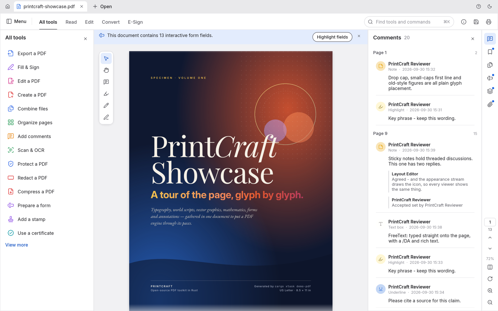
  <br>
  <sub>The PrintCraft Showcase, a 13-page specimen PDF, open with the All tools panel and threaded comments.</sub>
</p>

> [!NOTE]
> **ArtCraft is a community of artists from all walks of life.** Painters, photographers,
> filmmakers, illustrators, designers, animators, hobbyists, and people who picked up a pencil
> last week. If you make things, you're one of us. **[Come say hi on Discord](https://discord.gg/artcraft).**

<p align="center">
  <a href="#highlights">Highlights</a> ·
  <a href="#read-anything-beautifully">Read</a> ·
  <a href="#find-it-select-it-copy-it">Find</a> ·
  <a href="#organize-pages-like-cards-on-a-table">Organize</a> ·
  <a href="#combine-and-split-without-losing-a-thing">Combine &amp; split</a> ·
  <a href="#open-protected-documents-and-respect-their-rules">Protect</a> ·
  <a href="#comments-forms-layers-and-attachments">Forms &amp; layers</a> ·
  <a href="#runs-everywhere-stays-yours">Everywhere</a> ·
  <a href="#built-for-agents-too">Agents</a> ·
  <a href="#how-its-built">How it's built</a> ·
  <a href="#get-started">Get started</a> ·
  <a href="#whats-next">What's next</a> ·
  <a href="#the-crafting-apps">Crafting Apps</a>
</p>

---

## Community

PrintCraft is part of [ArtCraft](https://getartcraft.com). Come say hello, get help and follow development:

- **Discord: [discord.gg/artcraft](https://discord.gg/artcraft)**. This is the fastest way to get help and share feedback. The app has a Discord button in its title bar.
- **Web page:** [getartcraft.com/apps/printcraft](https://getartcraft.com/apps/printcraft)
- **Source:** [github.com/storytold/printcraft](https://github.com/storytold/printcraft)

The ArtCraft name and logos in `docs/brand/` belong to Storyteller and are not open source (see `docs/brand/LICENSE-brand.txt`). Forks must remove them.

## Highlights

<table>
<tr>
<td width="33%" valign="top">

### Faithful
Real-world typography: world scripts, vertical Japanese, colour emoji, gradients, soft masks and transparency. All of it renders the way the author intended.

</td>
<td width="33%" valign="top">

### Fearless
Every save appends your changes and leaves the original bytes untouched. Writes are atomic, undo runs deep, and nothing is lost if you close by mistake.

</td>
<td width="33%" valign="top">

### Yours
No account, no telemetry, no cloud. It works offline and opens instantly. The engine, CLI and app are all open source.

</td>
</tr>
</table>

---

## Read anything, beautifully

PrintCraft renders PDFs with care for the details that make a page feel right: kerning and ligatures, right-to-left and complex scripts, vertical CJK, colour emoji, shadings, blend modes, soft masks and optional content.

<p align="center">
  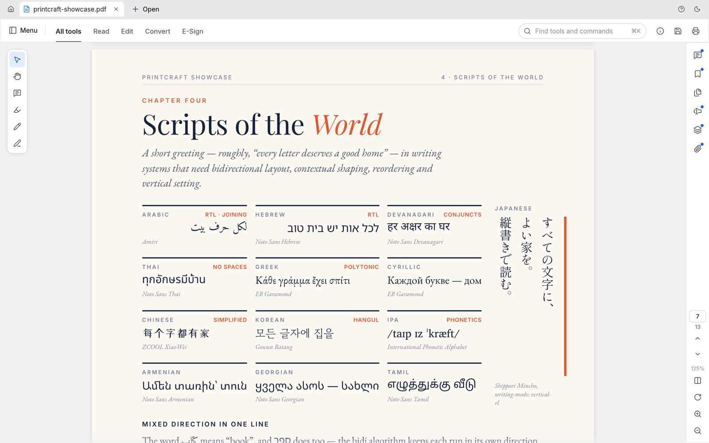
  <br>
  <sub>Twelve writing systems on one page, plus vertical Japanese, at 125%.</sub>
</p>

- **Deep zoom stays sharp.** Large pages render in tiles, so text stays crisp at any magnification.
- **Built to survive bad files.** Every page renders in isolation and damaged documents are repaired. Across the 983-file pdf.js test corpus the result is 0 crashes.
- **Layouts for every task:** continuous, single page, two-up, view rotation, full screen and a distraction-free Read mode.
- **Light and dark themes**, both designed to be easy on the eyes for long sessions.

<table>
<tr>
<td width="50%">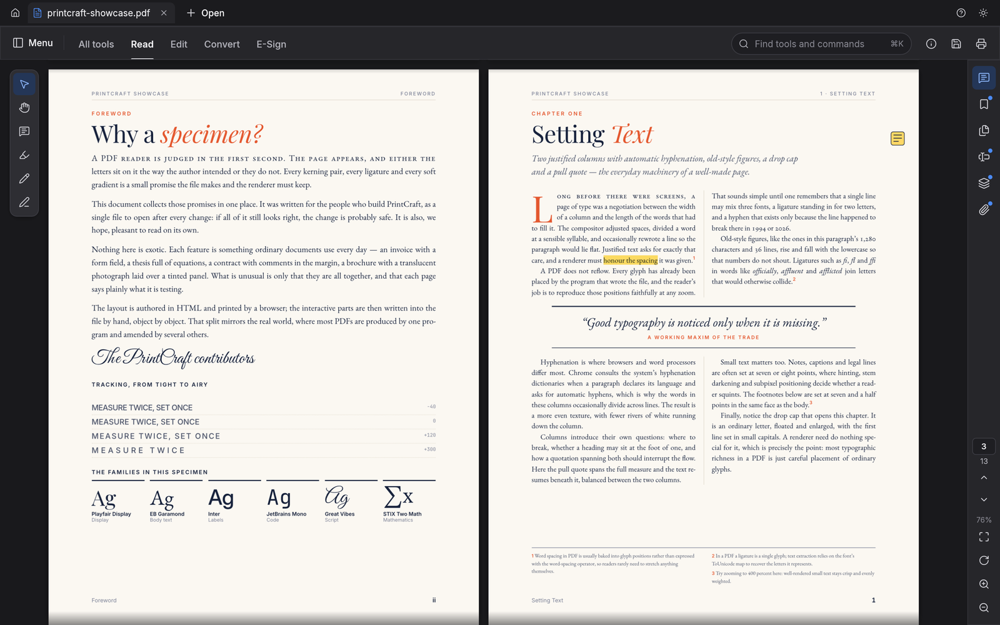</td>
<td width="50%">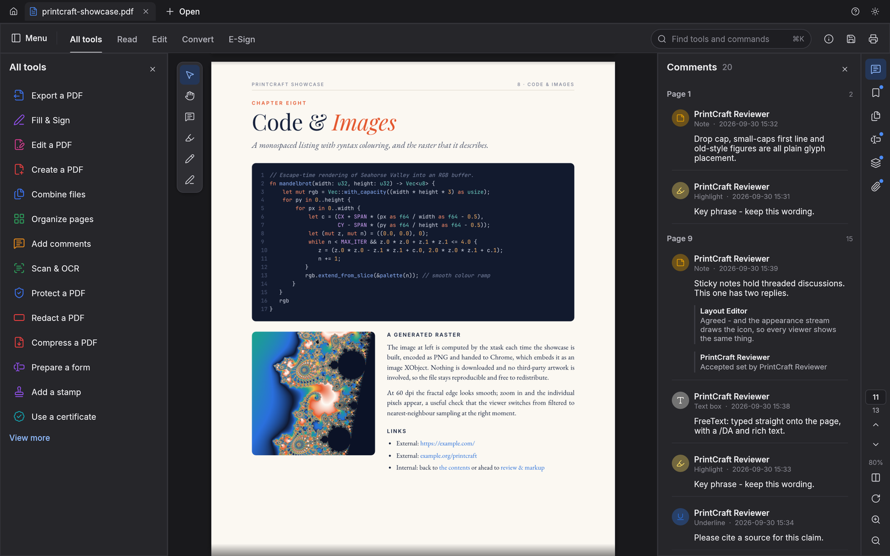</td>
</tr>
<tr>
<td align="center"><sub>Two-up Read mode, ready for long reading</sub></td>
<td align="center"><sub>The dark theme, with the comments panel open</sub></td>
</tr>
</table>

## Find it, select it, copy it

Search the whole document as you type, step through matches with <kbd>⌘G</kbd>, and select text that comes out in the right reading order. That holds for columns, right-to-left runs and CJK too.

## Navigate long documents

Bookmarks, page thumbnails and the document's own page labels (i, ii, 1, 2…) keep you oriented in long documents.

<table>
<tr>
<td width="50%">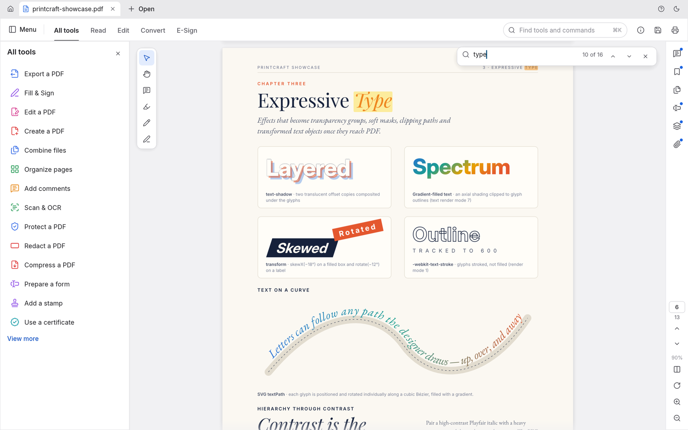</td>
<td width="50%">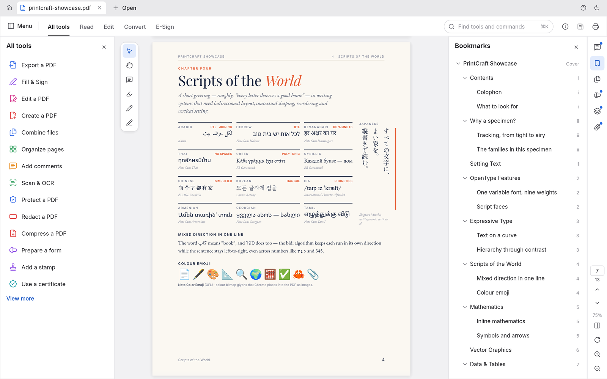</td>
</tr>
<tr>
<td align="center"><sub>Find as you type: match 10 of 16</sub></td>
<td align="center"><sub>Nested bookmarks with the document's own page labels</sub></td>
</tr>
</table>

---

## Organize pages like cards on a table

Open **Organize pages** to see every page at once:
- **Select pages:** click, <kbd>⌘</kbd>-click or <kbd>⇧</kbd>-click.
- **Change them:** rotate, delete, insert blank pages, insert pages from another file, and move them earlier or later.
- **Undo anything:** <kbd>⌘Z</kbd>, then save.

<p align="center">
  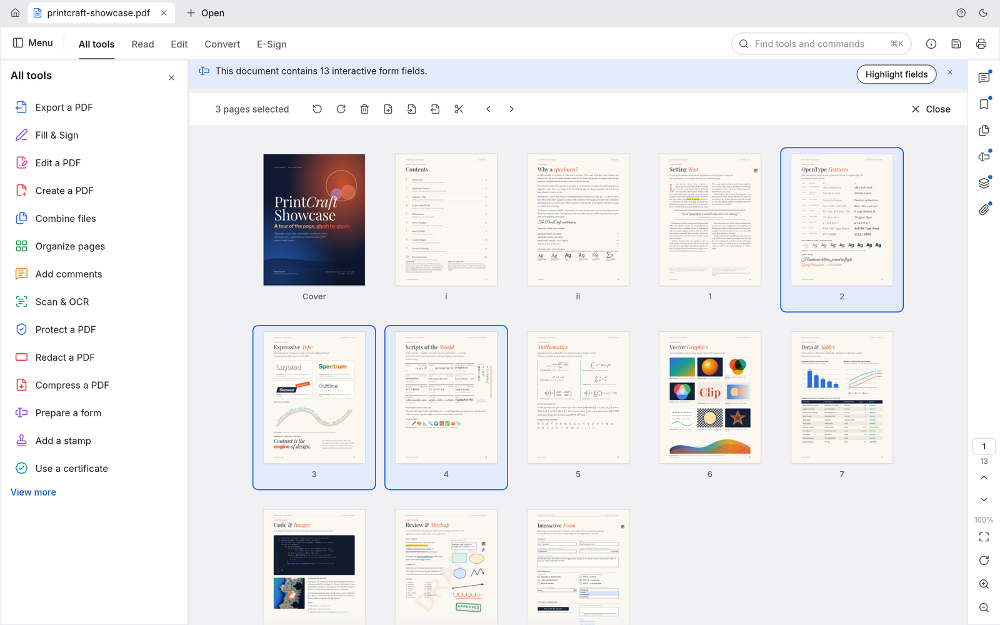
  <br>
  <sub>Organize pages with three pages selected and the page tools in the toolbar above.</sub>
</p>

<table>
<tr>
<td width="50%" valign="top">

**Undo that goes the distance.** Each change is one step in a history you can walk backwards and forwards. The Edit menu names the step ("Undo Rotate pages"), and undo still works after you save.

**Saves you can trust:**
- *Incremental:* the original bytes stay byte-for-byte intact.
- *Atomic:* the file is written to a temporary copy, then swapped in.
- *Verified:* independently checked with qpdf.

Unsaved documents carry a dot on their tab, and closing or quitting asks before anything is lost. Changes are autosaved every minute. If PrintCraft ever quits unexpectedly, it offers to recover your work the next time it opens. Encrypted documents stay encrypted on disk.

</td>
<td width="50%" valign="top">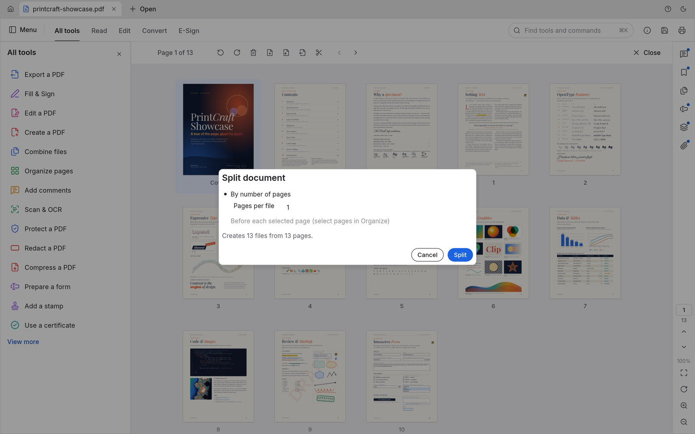<br><sub>Split document: one page per file makes 13 files.</sub></td>
</tr>
</table>

## Combine and split without losing a thing

**Combine files** merges any number of PDFs into one. Each file gets a bookmark, with its own bookmarks nested underneath.

**Extract** copies the pages you select into a new document. **Split** divides a document every *n* pages, or before the pages you choose.

Nothing quietly disappears along the way:
- links and named destinations are rewired to the copied pages;
- form fields stay interactive;
- layers keep their on/off defaults;
- attachments come along.

Every page of a combined document renders pixel-identical to its source.

```sh
printcraft-cli combine report.pdf appendix.pdf --out combined.pdf
printcraft-cli extract report.pdf --pages 1,3,5 --out highlights.pdf
printcraft-cli split   report.pdf --every 10 --out-dir parts/
```

---

## Open protected documents and respect their rules

PrintCraft implements the PDF standard security handler completely:
- every revision, from 40-bit RC4 to AES-256;
- user and owner passwords, including Unicode passwords normalised with SASLprep;
- crypt filters and attachment-only encryption.

Documents restricted by their author show a clear notice, and PrintCraft honours their permissions. Enter the owner password and the restrictions lift. Edits to encrypted documents are saved encrypted, under the same keys.

<table>
<tr>
<td width="50%" valign="top">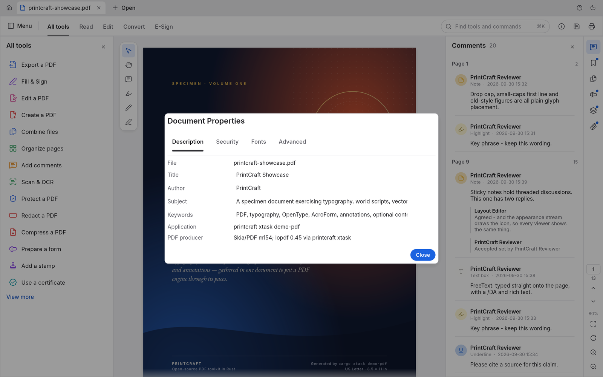<br><sub>Document Properties, Description tab</sub></td>
<td width="50%" valign="top">

**Document Properties** shows:
- the document's title, author, subject and keywords, which you can edit;
- the fonts it uses and whether each is embedded;
- PDF version, page size, tags, fields, layers and attachments;
- the full security picture: encryption method, which password opened it, and each permission.

</td>
</tr>
</table>

## Comments, forms, layers and attachments

<table>
<tr>
<td width="50%">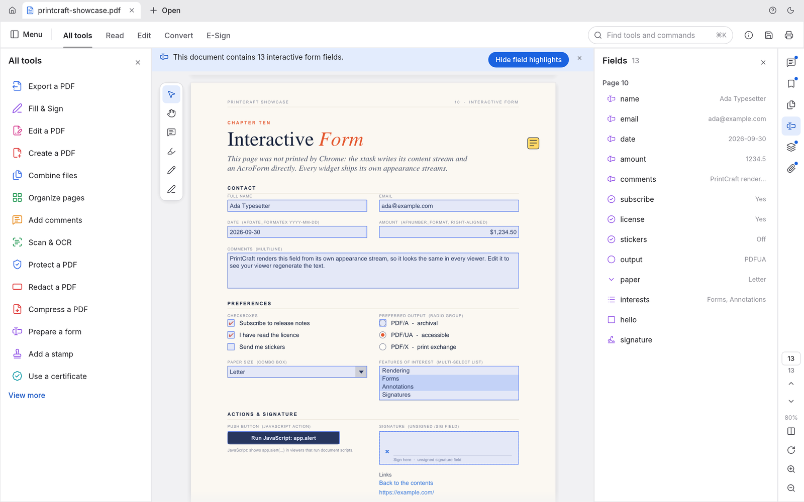</td>
<td width="50%">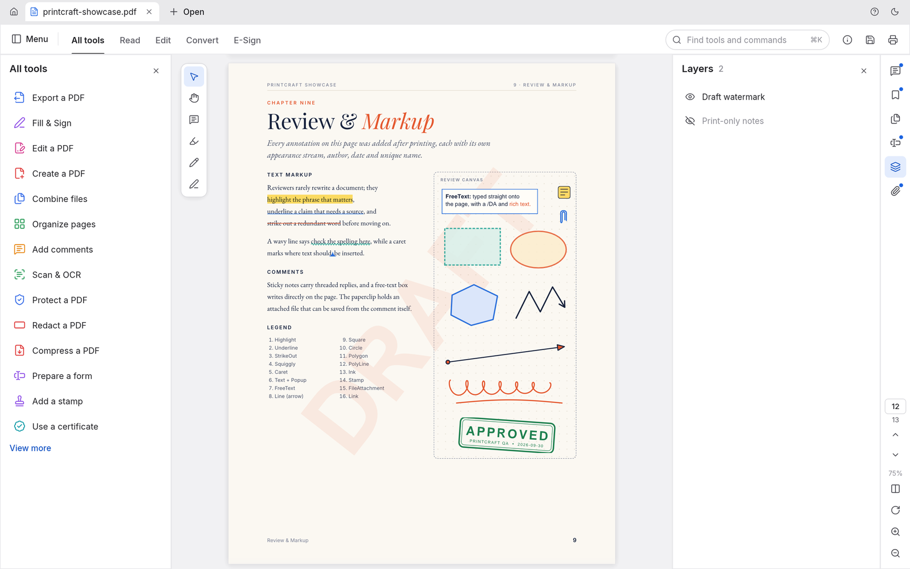</td>
</tr>
<tr>
<td valign="top"><b>Forms</b>: every field with its current value, field highlighting, and checkboxes, radio buttons, lists and signatures drawn the way their author designed them.</td>
<td valign="top"><b>Layers</b>: switch optional content on and off and the page re-renders instantly. <b>Comments</b> appear as threaded conversations, and <b>attachments</b> can be opened or saved.</td>
</tr>
</table>

## Every tool, one keystroke away

Press <kbd>⌘K</kbd> to search every tool and command, or browse the **All tools** catalogue. Tools that are still in development are marked with the milestone that will ship them.

<table>
<tr>
<td width="50%">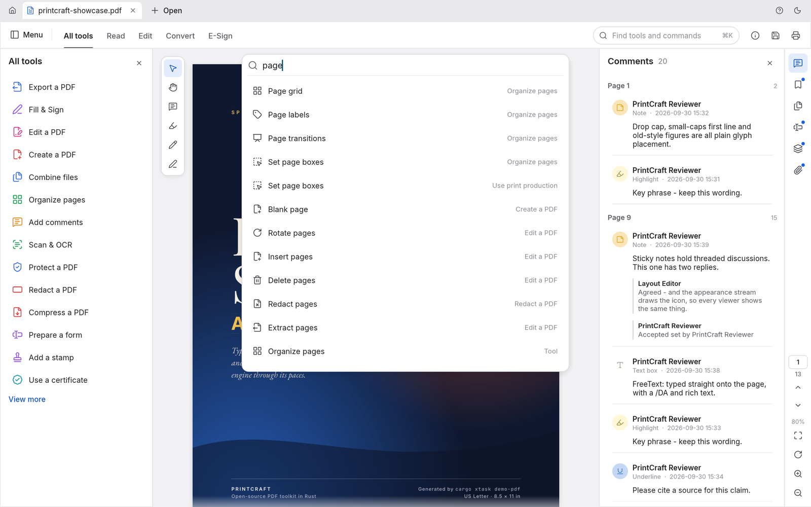</td>
<td width="50%">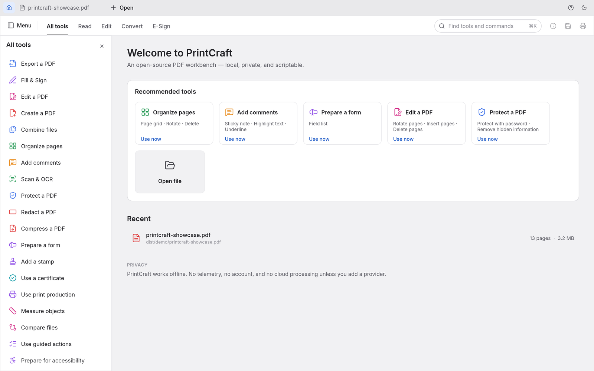</td>
</tr>
<tr>
<td align="center"><sub>The <kbd>⌘K</kbd> command palette</sub></td>
<td align="center"><sub>The home screen and the All tools catalogue</sub></td>
</tr>
</table>

---

## Runs everywhere, stays yours

- **Native on macOS, Windows and Linux**, and **in the browser** through WebAssembly, from the same Rust codebase.
- **Private by design.** Documents never leave your machine. There's no account, no telemetry and no cloud processing.
- **Engine first.** Parsing, rendering and editing live in reusable library crates. The interface is one swappable layer on top.
- **Scriptable.** The `printcraft-cli` tool (see [Built for agents, too](#built-for-agents-too)) covers inspecting, rendering, extracting text, editing, combining, extracting pages and splitting. Robustness sweeps run on the same engine as the app.

```sh
printcraft-cli info  form.pdf                                  # structure as JSON
printcraft-cli text  paper.pdf --page 3                        # reading-order text
printcraft-cli edit  in.pdf --rotate 1,2:90 --delete 5 --title "Q3" --out out.pdf
```

---

## Built for agents, too

Every engine feature is reachable without the GUI, through one table of JSON-Schema-described tools: open, inspect, render pages to PNG, extract and find text, rotate, delete, move and insert pages, edit bookmarks and page labels, add, reply to, restyle and delete comments (highlight a phrase just by naming it), set metadata, undo and redo, save, combine, extract and split. Three front doors share it:

- **`printcraft-cli run`**, for one-off calls and JSON scripts:

  ```sh
  printcraft-cli tools                                        # every tool and its JSON Schema
  printcraft-cli run text_find doc=1 query=invoice            # key=value; values parse as JSON
  printcraft-cli run --script review.json                     # e.g. comment_add {"type": "highlight", "find": "total due"}
  printcraft-cli run --script steps.json --root ./work        # several steps in one session
  ```

- **An MCP server**, for AI agents such as Claude. **It is opt-in:** PrintCraft never starts it on its own, and it opens no network port. It runs only while an agent launches `printcraft-cli mcp`, talks over stdin/stdout, and stops when the agent disconnects. To enable it, add it to your agent's MCP configuration:

  ```json
  { "mcpServers": { "printcraft": { "command": "printcraft-cli", "args": ["mcp", "--root", "/path/to/your/pdfs"] } } }
  ```

  `--root` confines every file the agent can read or write to one directory. Builds that should not include the server at all can use `cargo build -p printcraft-cli --no-default-features`.

- **The Rust API** (`printcraft_automation::Automation::call`), for embedding.

Edits stay in memory, undoable, until `doc_save`. Saving to the same file appends an incremental update, so the original bytes are preserved, and the write is atomic. Unsaved changes are never discarded silently.

### Driving the app itself

Start the desktop app with `printcraft --control /tmp/pc.json` and an agent can see and operate the real interface: the widget tree with labels and positions (from the accessibility tree), clicks, typing, keys, commands, view options and screenshots. This is also off by default. It listens only on loopback, and every connection must present the random token written to that file, which only you can read.

```sh
printcraft-cli ui --control /tmp/pc.json inspect query=rotate      # find widgets
printcraft-cli ui --control /tmp/pc.json click label="Organize pages"
printcraft-cli ui --control /tmp/pc.json key key=K modifiers='["command"]'
printcraft-cli ui --control /tmp/pc.json command id=comment.square   # pick a tool, then draw:
printcraft-cli ui --control /tmp/pc.json drag from='[400,300]' to='[600,420]'
printcraft-cli ui --control /tmp/pc.json screenshot --out window.png
```

---

## How it's built

PrintCraft is a Cargo workspace of focused crates, layered so the core never depends on the UI:

| Crate | What it does |
|---|---|
| `printcraft-filters` | Every PDF stream filter (Flate, LZW, ASCII85, RunLength, predictors), encode and decode, property-tested |
| `printcraft-crypt` | The standard security handler: RC4, AES-128/256, revisions 2–6, permissions |
| `printcraft-cos` | The PDF object layer: tolerant parsing, repair, copy-on-write edits, incremental and full writing |
| `printcraft-organize` | Page operations, combine / extract / split, bookmarks, page labels, document information |
| `printcraft-annot` | Comments: builders and appearance streams for notes, text markup, shapes, ink and text boxes; replies, status, edits |
| `printcraft-render` | Rendering, inspection and text extraction with reading order |
| `printcraft-engine` | The façade every frontend uses: sessions, edits, undo, saving, the tool catalogue |
| `printcraft-automation` | Agent control: the headless tool table, `printcraft-cli run`, and the opt-in MCP server |
| `printcraft-ui-egui` | The desktop and web interface |

**Quality gates.** Every change passes the same automated checks:
- formatting, and Clippy with warnings as errors;
- 200+ unit, property and UI tests;
- crate-layering rules and a WebAssembly build check;
- an asset-licence audit.

On top of those, two corpus sweeps run over real-world files:
- **Opening and rendering:** of the 983 pdf.js test files, 963 open and render cleanly, with 0 crashes.
- **Open, edit and save round trips:** 958 succeed.

The output is verified with independent tools: hayro, qpdf and poppler.

PrintCraft is a clean-room implementation. Its behaviour comes from the ISO 32000 specification and black-box observation, never from anyone else's code. Every icon, font and image is openly licensed and listed in [ATTRIBUTION.md](ATTRIBUTION.md).

## Get started

```sh
git clone https://github.com/storytold/printcraft
cd printcraft
cargo run --release -p printcraft -- some.pdf     # desktop app
cargo xtask demo-pdf                              # build the showcase PDF used in these screenshots
cargo xtask screenshots                           # regenerate every screenshot in this README
```

## What's next

PrintCraft is young and moving fast. The aim is a workbench where you can view, organize, annotate, fill, sign and edit PDFs, at parity with Acrobat Pro.

**Available today:**
- viewing, search and navigation;
- organizing pages, combining, extracting and splitting; bookmarks and page labels;
- commenting: sticky notes, highlight / underline / strikethrough, text boxes, freehand drawing, lines, arrows, rectangles and ovals, with replies, status, colours, moving, resizing and a searchable Comments panel;
- document information;
- opening encrypted documents, honouring their permissions, and saving them encrypted;
- undo and safe saving;
- autosave with crash recovery;
- a single command registry behind menus, shortcuts and the palette;
- agent control through the CLI and an opt-in MCP server.

**On the roadmap:**

| Next up | Milestone |
|---|---|
| Page boxes | M4 |
| Callouts, clouds, stamps, FDF/XFDF, comment summaries | M5 |
| Filling and authoring forms, JavaScript | M6 |
| Editing text and images in place, headers, watermarks | M7 |
| Adding passwords, redaction | M8 |
| Digital signatures (PAdES) | M9 |
| OCR, export to Office formats, printing | M10 |
| Optimize, preflight, PDF/A | M11 |
| Accessibility, compare, measure | M12 |

The full plan, with progress and estimates, is in **[ROADMAP.md](ROADMAP.md)**.

---

## The Crafting Apps

PrintCraft is one of the **Crafting Apps**: free, open-source creative tools from the
[ArtCraft](https://getartcraft.com/) team, each written from scratch in Rust and each able to
stand on its own.

| App | What it's for | Code | Learn more |
|---|---|---|---|
|  | Image editing: layers, masks, type and real PSD files | [GitHub](https://github.com/storytold/photocraft) | [getartcraft.com](https://getartcraft.com/apps/photocraft) |
|  | Vector illustration (formerly DrawCraft) | [GitHub](https://github.com/storytold/vectorcraft) | [getartcraft.com](https://getartcraft.com/apps/drawcraft) |
|  | Video editing, color and sound | [GitHub](https://github.com/storytold/filmcraft) | [getartcraft.com](https://getartcraft.com/apps/filmcraft) |
|  | Photo library and raw development | [GitHub](https://github.com/storytold/lightcraft) | [getartcraft.com](https://getartcraft.com/apps/lightcraft) |
|  | **Reading, organizing and protecting PDFs** · **you are here** | [GitHub](https://github.com/storytold/printcraft) | [getartcraft.com](https://getartcraft.com/apps/printcraft) |
|  | Motion graphics and visual effects | [GitHub](https://github.com/storytold/effectcraft) | [getartcraft.com](https://getartcraft.com/apps/effectcraft) |
|  | Page layout and publishing | [GitHub](https://github.com/storytold/designcraft) | [getartcraft.com](https://getartcraft.com/apps/designcraft) |

And [**ArtCraft**](https://getartcraft.com/) itself, our AI image and video studio for artists who want real control.

<br>

<p align="center">
  <a href="https://discord.gg/artcraft"></a>
</p>

<h3 align="center">Come make things with us</h3>

<p align="center">
  Our Discord is where artists of every kind hang out: people who paint, shoot, draw, cut film,
  set type, and people still figuring out what they like to make. Share what you're working on,
  ask for help, tell us what's broken, or tell us what you wish these tools could do.
  Whatever your medium and however long you've been at it, you're welcome here.
</p>

<p align="center">
  <a href="https://discord.gg/artcraft"><b>discord.gg/artcraft</b></a> ·
  <a href="https://getartcraft.com/">getartcraft.com</a> ·
  <a href="https://getartcraft.com/apps">The Crafting Apps</a> ·
  <a href="https://getartcraft.com/apps/printcraft">PrintCraft</a>
</p>

---

## Licence

MIT OR Apache-2.0 ([LICENSE-MIT](LICENSE-MIT), [LICENSE-APACHE](LICENSE-APACHE)). Every icon, font and image is openly licensed and listed, with its author and source, in [ATTRIBUTION.md](ATTRIBUTION.md). The policy is in [AGENTS.md](AGENTS.md), and required notices are in [NOTICE](NOTICE). Contributors and agents: read [AGENTS.md](AGENTS.md) and [CLAUDE.md](CLAUDE.md).

<sub>Adobe, Acrobat, Photoshop, Illustrator, Premiere Pro and Lightroom are trademarks of Adobe Inc. PrintCraft is an independent project, not affiliated with or endorsed by Adobe.</sub>

<p align="center">
  <a href="https://getartcraft.com/"></a><br>
  <sub>Made by the <a href="https://getartcraft.com/">ArtCraft</a> team and community.</sub>
</p>
