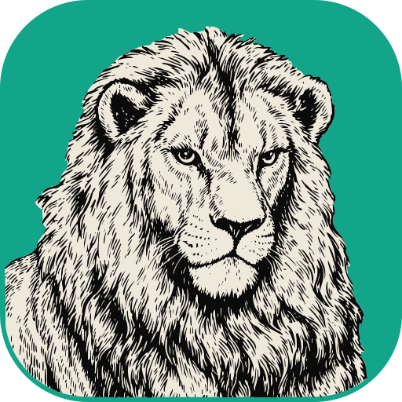

# PrintCraft app icon



**Creature:** a lion, in a frontal head-and-shoulders portrait, mane running off the bottom of the tile.

**Style:** an engraving (woodcut-weight line work) portrait in the Crafting Apps "owl template" framing:
a full-bleed colour field, no frame or roundel, the animal looking at the viewer and filling the tile.

**Palette:** exactly three colours.

| Colour | Hex | Used for |
|---|---|---|
| Ink | `#0b0b0c` | line work and the figure's contour |
| Paper | `#efe9dc` | the figure (the lion's silhouette) |
| PrintCraft green (app colour) | `#12a58a` | the full-bleed field |

**Tile:** `viewBox="0 0 512 512"`, a rounded square with `rx=112` that clips everything. Windows and Linux
icons use the full-bleed tile. macOS icons put it on Apple's grid (an 824 px body centred on a transparent
1024 px canvas).

**Provenance:** the project owner's original drawing, made in ArtCraft (2880 px, keyed to the palette), then
vectorised with craftrules `assets/logo-options/_tools/vectorize_tile.py` (potrace; no filtering or
warping). The source drawing is kept in craftrules at `assets/app-icons/printcraft/source.png`, not here.
Licence: [LICENSE.txt](LICENSE.txt) (`MIT OR Apache-2.0`, like the repo).

## Files

| File | What it is |
|---|---|
| `printcraft.svg` | the master vector (traced at 2048 px); every PNG, `.ico` and `.icns` is rendered from it |
| `printcraft-small.svg` | a lighter vector (traced at 1024 px) for places where size matters, such as this README |
| `printcraft-1024.png` | 1024 px on Apple's grid; also the runtime Dock icon on macOS |
| `printcraft.icns` | macOS icon (16–1024 px) |
| `printcraft.ico` | Windows icon (16–256 px), embedded in `printcraft.exe` by `apps/printcraft/build.rs` |
| `hicolor/<n>x<n>/apps/ai.storyteller.printcraft.png` | Linux hicolor theme, 16–512 px; the 256 px one is the runtime icon on Windows and Linux |
| `hicolor/scalable/apps/ai.storyteller.printcraft.svg` | Linux scalable icon (copy of the master) |

Where it shows: `apps/printcraft/src/main.rs` sets the window icon (Dock, taskbar, Alt-Tab, launcher) and the
Wayland app id `ai.storyteller.printcraft`; `packaging/linux/ai.storyteller.printcraft.desktop` names the
hicolor icon.

## Regenerate

```sh
packaging/icons.sh        # needs resvg and python3; iconutil (macOS) for the .icns
cargo xtask assets        # then update the sha256 values in ATTRIBUTION.toml and run with --write
```
